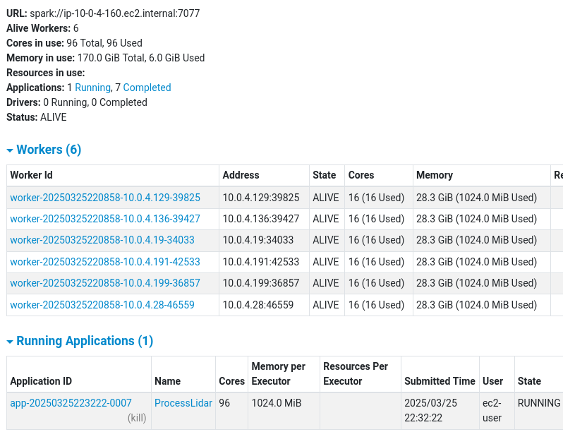
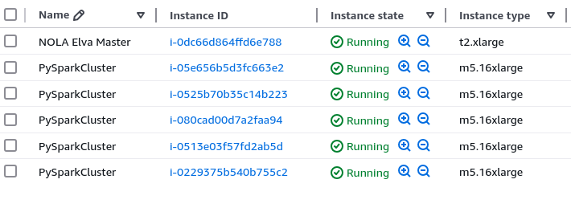
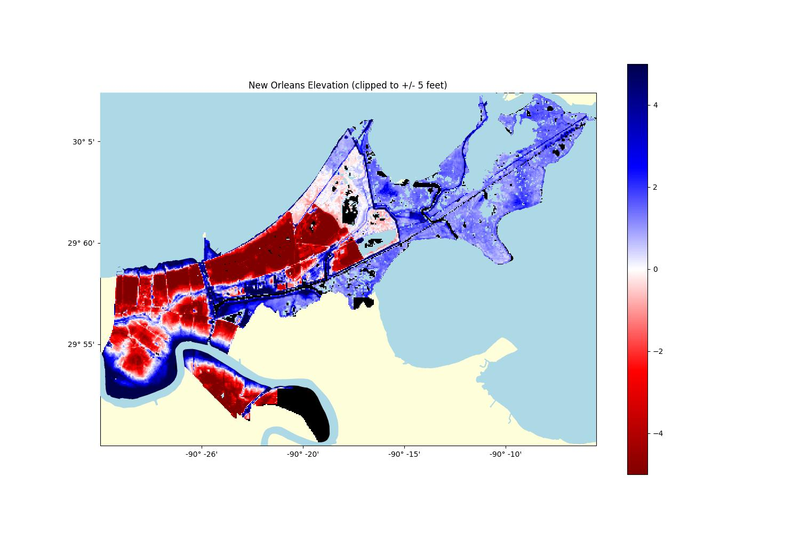

# New Orleans Elevation Map

* This is a work in progress... *

### Description

This is a small project I made to familurize myself with some GeoSpatial tools...but then things got out of control.  Now its a project that utilizes PySpark to reduce huge amounts of LIDAR data.  

But ultimately the idea is to make elevation maps of New Orleans and some of its neighborhoods in a way the highlights positions relative to 0 altitude to give a good idea of what happens during flood, which way water flows and if you are above or below the water level.

I may also go back and compare elevations to official flood zone maps and see where things dont align...

### Datasets

Datasets include publically availble shapefiles for New Orleans, and USGS Lidar data.

* [LADOTD New Orleans LA Lidar 2021](https://rockyweb.usgs.gov/vdelivery/Datasets/Staged/Elevation/metadata/LA_2021GreaterNewOrleans_C22/LA_2021GNO_1_C22/reports/LADOTD_New_Orleans_Lidar_LidarMappingReport.pdf)
* [USGS Water Map](https://pubs.usgs.gov/of/1998/of98-805/lpdata/arcview/water.zip)
* [Neighborhood Statistical Area](https://data.nola.gov/dataset/Neighborhood-Statistical-Area/exvn-jeh2/about_data)

### Outputs

You can download the raw data produced by ProcessLidar.ipynb from my requester pays S3 bucket s3://requesterpays.garyscorner.net/datasets/NewOrleansElevation/

[How to download from a requester pays bucket](https://docs.aws.amazon.com/AmazonS3/latest/userguide/ObjectsinRequesterPaysBuckets.html)
