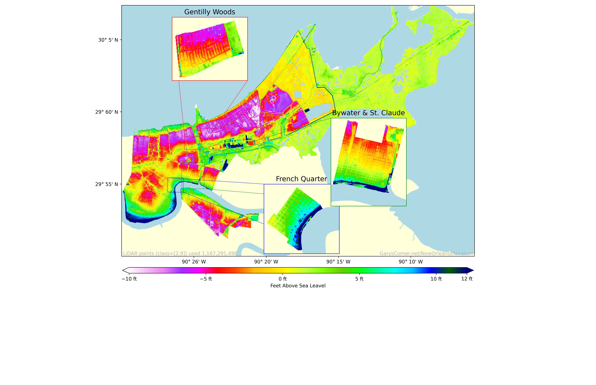

# New Orleans Elevation Map

### Description

This is a small project I made to familiarize myself with some GeoSpatial tools...but then things got out of control. Now its a project that utilizes PySpark to reduce huge amounts of LiDAR data. 

But ultimately the idea is to make elevation maps of New Orleans and some of its neighborhoods in a way thats looks cool and is useful when flooding starts. Also I wanted a pretty poster for my wall.

I may also go back and compare elevations to official flood zone maps and see where things dont align, but that would be a different project.

### Background

* [Car Blocking Lafitte Canal](https://www.wdsu.com/article/s-wb-atleast-one-car-found-underground-blocking-lafitte-canal/28775794)
* [WikiPedia: Drainage in New Orleans](https://en.wikipedia.org/wiki/Drainage_in_New_Orleans)
* [New Orleans Drainage Live Dashboard](https://www.swbno.org/Stormwater/Overview)

If you don't live in the city you may not be aware of how common flooding events are.  Sure everyone knows about major flooding events like Katrina, but New Orleans actually has to deal with flooding events much more frequently.  New Orleans is functionally a bowl that sits in the middle of lake Pontchartrain, lake Borgnue, and some wetlands to the east and west (for the purposes of flooding wetlands are just really really dirty lakes).  Because of this water has to be constantly pumped out of the city using a complex network of canals and pumps, some of which are over 100 years old and rely on generated power at atypical frequencies for which replacement parts do not exist.  All this is to say that a mechanical failure of some very old equipment can turn a regular summer downpoor into a flooding event that damages homes and local businesses (probably AirBnBs too but its hard to care about that).

What this means in practice for a lot of us is that we receive updates from the news on the status of our local pumping station (I consider myself lucky to be upstream of trusty DPS 4). Then during the rainfall we'll stand on our porches and watch the water build and hopefully flow downhill towards the drainage canals and in my area the collection points (idk they just installed them I really should attend the neighborhood meetings). If there is no flow then that's trouble but it will usually resolve itself without major indecent. However when the flow reverses that's a real problem, which can happen when when there is a blockage like a [car (yes a whole car)](https://www.wdsu.com/article/s-wb-atleast-one-car-found-underground-blocking-lafitte-canal/28775794), that's when things can get problematic real quick.

To wit this is a elevation map (I'm told a topography map has contour lines) that gets down to the 10m resolution.  Once this map is in poster size I should be able to use it to get a good idea of where the water should be flowing, and collecting in any part of the city down to the home level.  As long as you can find yourself on a map you should be able to tell.  The poster quality version of this project can be found in my requester pays S3 bucket, see [Outputs](#Outputs)

### Datasets

Datasets include public ally available shapefiles for New Orleans, and USGS Lidar data.

* [LADOTD New Orleans LA Lidar 2021](https://rockyweb.usgs.gov/vdelivery/Datasets/Staged/Elevation/metadata/LA_2021GreaterNewOrleans_C22/LA_2021GNO_1_C22/reports/LADOTD_New_Orleans_Lidar_LidarMappingReport.pdf)
* [USGS Water Map](https://pubs.usgs.gov/of/1998/of98-805/lpdata/arcview/water.zip)
* [Neighborhood Statistical Area](https://data.nola.gov/dataset/Neighborhood-Statistical-Area/exvn-jeh2/about_data)

### Outputs

You can download the raw data produced by ProcessLidar.ipynb and PostProcessLidar.ipynb from my requester pays S3 bucket s3://requesterpays.garyscorner.net/datasets/NewOrleansElevation/

[How to download from a requester pays bucket](https://docs.aws.amazon.com/AmazonS3/latest/userguide/ObjectsinRequesterPaysBuckets.html)

### Screencaps

### Comments

I wrote the PySpark to run on my customized cluster, because its a lot cheaper then doing it the AWS way. And so the LAZ files are loaded right from the HDD on workers since the workers are just cloned snapshots of the master, hence no reason to distribute the files.

The functions I used to aggregate the data turned out to be garbage they did not scale well and there usage was shameful, however by the time I realized this it was clear that I could just pay Biff Bezos another few $$$ to get the reduced data, and that path was easier then rewriting the aggregation using NumPy or something. Its easy to forget that my time is still worth more then Biff Bezos' computers time even if I don't like paying the jerk.

I also went a little overboard passing arguments between the functions plotFig and createMap, little embarrassing to see it now, I should go back and either to a kw_args style, or better createMaps should be part of a class.  Well see if that ever gets done I suspect once my poster is printed I'll be happy enough to put this project to bed.

This project started out small, want eventually I just started it again from scratch, probably should have started a new repository, opps but hey Im happy with how it turned out.
The NewOrleansPoster.png which you can find in my S3 bucket is optimized for printing online at FedEx (I just got a rescued an 8 week old puppy and leaving the house is impossible so I'll probably be paying another evil corpo to print this instead of a local business :(

Thanks for your interest, 

[Gary B](mailto:Gary@GarysCorner.net)
